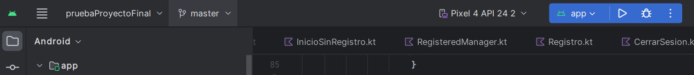

# Despliegue de la aplicación

Para poder probar la aplicación, uso un emulador de Android de Android Studio. Puedes probar la aplicación clonando mi repositorio y abriendolo en Android Studio.

1.  Clona el repositorio:

    `git clone`[`https://github.com/loscarpab/ProyectoFinal2Dam.git`](https://github.com/loscarpab/ProyectoFinal2Dam.git)
2. Abrelo en Android Studio
3. Pincha en iniciar app
   *   &#x20;

       <figure><figcaption></figcaption></figure>
4. Una vez iniciada la app pincha en registrarte, rellena los campos y vuelve a pinchar en registrarse
   *

       <figure><figcaption></figcaption></figure>
   *

       <figure><figcaption></figcaption></figure>
5. Y ya estarías dentro de la aplicación

<figure><figcaption></figcaption></figure>
